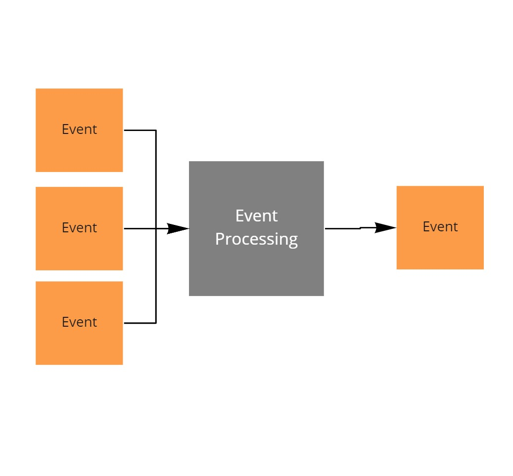

# Implementing an event processor

This project is part of the [MessageHandler processing patterns](https://www.messagehandler.net/patterns/) library.

MessageHandler is distributed under a commercial license, for more information on the terms and conditions refer to [our license page](https://www.messagehandler.net/license/).

## What is event processing

Event processing converts streams of events into new events.



## When to use it

Use event processing to filter, count, group, join or window event streams and react to the result.

## Scenario

In this scenario the event processor will inspect the SensorValueChanged events (emitted by the event generator) and computes the average value over a time period of 10 seconds.

## What you need to get started

- The [.NET 6 SDK](https://dotnet.microsoft.com/en-us/download) should be installed
- The sample was created using [Visual Studio 2022 community edition](https://visualstudio.microsoft.com/vs/).
- To send events an [event hubs namespace](https://learn.microsoft.com/en-us/azure/event-hubs/event-hubs-create) is used.
- A general purpose [azure storage account](https://docs.microsoft.com/en-us/azure/storage/common/storage-account-create?tabs=azure-portal) is used to store the offsets of the event hubs.
- The **MessageHandler.Runtime.StreamProcessing** package is available from [nuget.org](https://www.nuget.org/packages/MessageHandler.Runtime.StreamProcessing/)

## Running the sample

Prior to being able to run the sample, you need to [configure the user secrets file](https://docs.microsoft.com/en-us/aspnet/core/security/app-secrets?view=aspnetcore-6.0&tabs=windows#manage-user-secrets-with-visual-studio).

In the secrets file you must specify the following configuration values.

```JSON
{
  "eventhubsnamespace": "your event hubs connection string goes here",
  "azurestoragedata": "your storage connection string goes here"
}
```

Also ensure an event hub named `receivehub` and `sendhub` is created up front in the eventhubs namespace.

And a container named `leases` should be present in the azure storage account.

Once configured you can start the worker or run the unittests.

## Designed with testing in mind

MessageHandler is intented to be test friendly.

This sample contains plenty of ideas on how to test an event processor without requiring a dependency on an actual broker instance, nor storage account, and thus keep the tests fast.

- [Component tests](https://github.com/MessageHandler/MessageHandler.Quickstarts.EventProcessing/tree/master/src/Tests/ComponentTests): To test the interaction between the event processor and the receive infrastructure.
- [Contract tests](https://github.com/MessageHandler/MessageHandler.Quickstarts.EventProcessing/tree/master/src/Tests/ContractTests): To verify that the test doubles used in the component tests are behaving the same as an actual dependency would. Note: contract verification files are often shared between producers and consumers of the contract.

## How to implement it yourself

Check out [this how to guide](https://www.messagehandler.net/docs/guides/stream-processing/configuration/) to learn how to configure a stream processing pipeline.